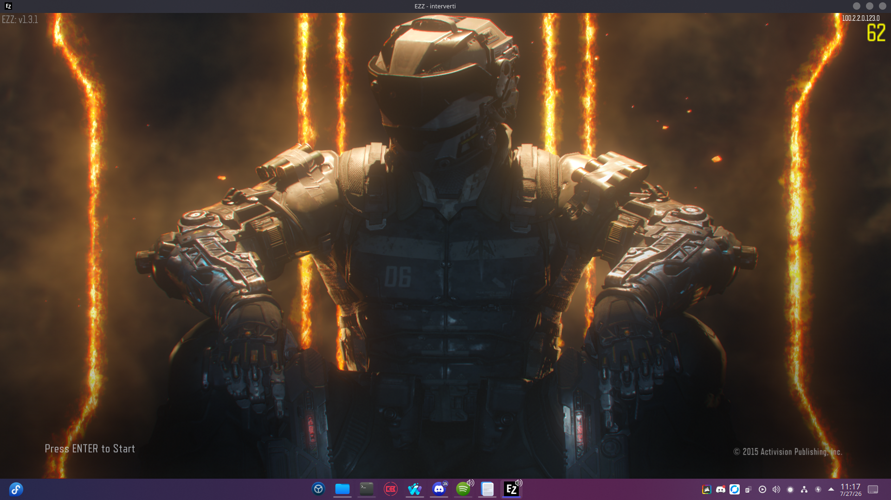
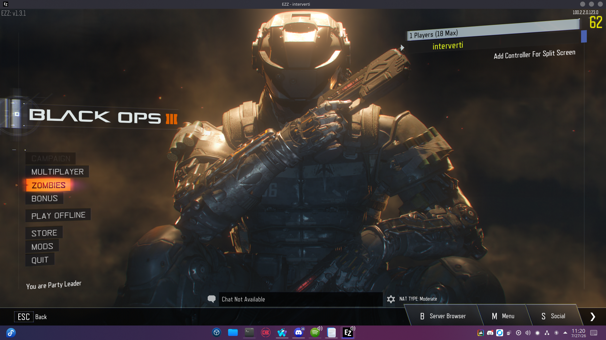

<div align="center">

# 🎮 BO3 Linux

Run **Call of Duty®: Black Ops III** with the **EZZ BOIII Client** on **Fedora Linux** using **Wine + DXVK**.


[](https://opensource.org/licenses/MIT)

Simple guide to install and play **BO3** on Fedora Linux using **Wine**, **DXVK**, and the **EZZ BOIII Client**.

</div>

---

## 📸 Preview

<p align="center">
  
  
</p>

> [!NOTE]
> These screenshots were captured on **Fedora Linux** using **Wine + DXVK** with the **EZZ BOIII Client**.

---

## ✨ Features

- 🎮 Play **Call of Duty®: Black Ops III** using the **EZZ BOIII Client**
- 🐧 Fedora-focused setup
- ⚡ Vulkan rendering through **DXVK**
- 🔊 PipeWire / PulseAudio support
- 🚀 Lightweight launcher script
- 🧩 Supports Zombies, Multiplayer, Mods and Custom Maps
- 🛠️ Easy to reproduce on a fresh Wine prefix

---

> [!IMPORTANT]
> This guide assumes you already own **Call of Duty: Black Ops III**.

## 📦 Requirements

- Fedora 41+
- Wine
- Winetricks
- Vulkan drivers
- BO3 Windows installation

---

# 🍷 Install Wine

```bash
sudo dnf install wine winetricks
```

Install the required libraries:

```bash
sudo dnf install \
    wine.i686 \
    mesa-vulkan-drivers \
    mesa-vulkan-drivers.i686 \
    vulkan-loader \
    vulkan-loader.i686 \
    libX11.i686 \
    libXext.i686 \
    libXrandr.i686 \
    alsa-lib.i686 \
    pulseaudio-libs.i686
```

---

# 📁 Create the Wine Prefix

```bash
export WINEPREFIX="$HOME/.wine-bo3"
export WINEARCH=win64

wineboot -u
```

---

# ⚙️ Configure Wine

Install DXVK:

```bash
export WINEPREFIX="$HOME/.wine-bo3"

winetricks -q dxvk
```

Enable PulseAudio:

```bash
export WINEPREFIX="$HOME/.wine-bo3"

winetricks -q sound=pulse
```

---

# 🎮 Install Steam

Download Steam:

```bash
cd /tmp

wget https://cdn.akamai.steamstatic.com/client/installer/SteamSetup.exe

wine SteamSetup.exe
```
> [!NOTE]
> Steam is only required for the initial setup of the EZZ BOIII client.
> Once installed, leave the Steam installation untouched.

---

# 🚀 Launch BOIII

Create `launch-bo3.sh`

```bash
#!/bin/bash

export WINEPREFIX=~/.wine-bo3
export PULSE_LATENCY_MSEC=60
export WINEDLLOVERRIDES="winepulse.drv=b;winealsa.drv=n;dsound=n,b;xinput1_0=b;xinput1_2=b;xinput_9_1_0=b;XINPUT_9_1_0=b;xinput1_3=b;xinput=b"

cd "/path/to/Black Ops III" || { echo "Dossier du jeu introuvable !"; exit 1; }

wine boiii.exe -unsafe-lua -nointro -noupdate -nosteam -noratelimit -mitigatepacketspam

```

Make it executable:

```bash
chmod +x launch-bo3.sh
```

Run it:

```bash
./launch-bo3.sh
```

---

# 🔧 Troubleshooting

### Black screen

- Verify Vulkan is installed.
- Reinstall DXVK.

### No audio

Run:

```bash
winetricks sound=pulse
```

### Game crashes

Delete the Wine prefix:

```bash
rm -rf ~/.wine-bo3
```

and recreate it.

---

# ⚠️ Disclaimer

This repository **does not** distribute any game files.

You must legally own **Call of Duty: Black Ops III**.

---

## ✅ Compatibility

| Component | Status |
|-----------|:------:|
| Fedora 41 | ✅ |
| Fedora 42 | ✅ |
| AMD GPU | ✅ |
| Intel GPU | ✅ |
| NVIDIA Proprietary Driver | ✅ |
| PipeWire | ✅ |
| X11 | ✅ |
| Wayland | ✅ |

## ❓ FAQ
<details>
<summary>How can i play with my friend who plays on Windows and Linux?</summary>

Things like Radmin VPN cant be used with this method so i recommend to use something like [playit](https://playit.gg/) for the person who host with a **UDP** tunnel on port **27017** or **27018**

</details>

<details>
<summary>Does this work with Steam Proton?</summary>

No.

This guide is specifically designed for **Wine** and the **EZZ BOIII Client**.

</details>

<details>
<summary>Can I play Zombies?</summary>

Yes.

BOIII supports Zombies, Multiplayer and Mods.

</details>

<details>
<summary>Can I use PipeWire?</summary>

Yes.

PipeWire provides PulseAudio compatibility on Fedora.

</details>

## ❤️ Credits

| Project | Description |
|---------|-------------|
| [EZZ BOIII](https://github.com/Ezz-lol/boiii-free) | Community BOIII client |
| [Wine](https://www.winehq.org/) | Windows compatibility layer |
| [Winetricks](https://github.com/Winetricks/winetricks) | Wine helper scripts |
| [DXVK](https://github.com/doitsujin/dxvk) | Direct3D → Vulkan translation |
| [Fedora Project](https://fedoraproject.org/) | Linux distribution |

---

<p align="center">

Made with ❤️ for the Linux Gaming community.

</p>
